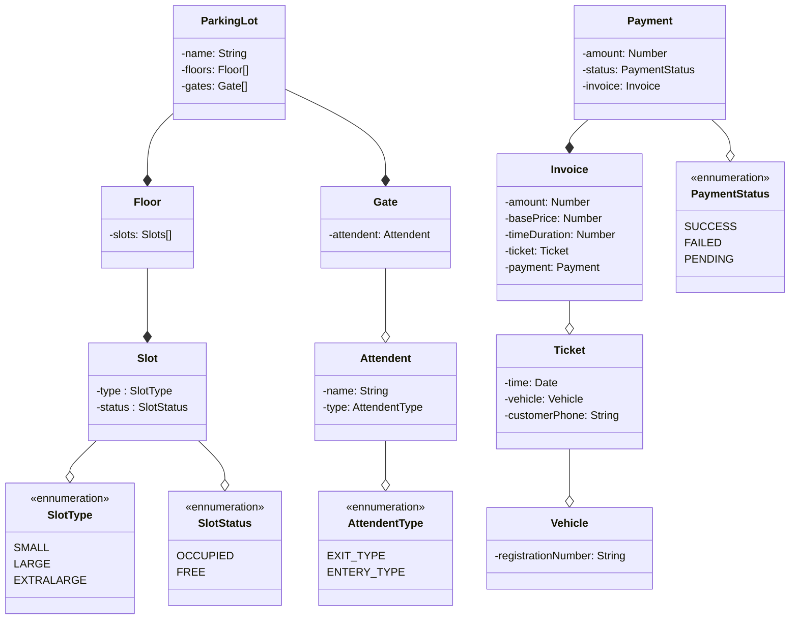

```mermaid
classDiagram
 class ParkingLot {
    -name: String
    -floors: Floor[]
    -gates: Gate[]
 }
 class Floor {
    -slots: Slots[]
 }
 class Slot {
    -type : SlotType
    -status : SlotStatus
 }
 class SlotStatus{
    <<ennumeration>>
    OCCUPIED
    FREE
 }
  class SlotType{
    <<ennumeration>>
    SMALL
    LARGE
    EXTRALARGE
 }
 class Ticket {
    -time: Date
    -vehicle: Vehicle
    -customerPhone: String
 }
 class Gate {
    -attendent: Attendent
 }
 class Attendent {
    -name: String
    -type: AttendentType
 }
 class Invoice {
    -amount: Number
    -basePrice: Number
    -timeDuration: Number
    -ticket: Ticket
    -payment: Payment
 }
 class Payment {
    -amount: Number
    -status: PaymentStatus
    -invoice: Invoice
 }
 class Vehicle {
    -registrationNumber: String
 }

 class PaymentStatus{
    <<ennumeration>>
    SUCCESS
    FAILED
    PENDING
 }
 class AttendentType{
    <<ennumeration>>
    EXIT_TYPE
    ENTERY_TYPE
 }
 
 ParkingLot --* Floor
 ParkingLot --* Gate
 Floor --* Slot
 Slot --o SlotType
 Slot --o SlotStatus
 Gate --o Attendent
 Ticket --o Vehicle
 Invoice --o Ticket
 Payment --o PaymentStatus
 Attendent --o AttendentType
 Payment --* Invoice
```

Further Gate can be devided into two subclasses like - EntryGate and ExitGate
EntryGate: DisplayBord and ExitGate: PaymentCounter but this won't change design a lot so 
I am leaving this part